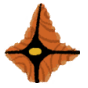
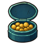
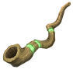
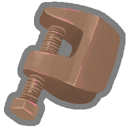

  
  <h2> Sts2BalanceMod </h2>
  
 Sts2BalanceMod — 《杀戮尖塔 2》平衡调整 Mod 

  

    
    
    
    
    
  

   
  
  
  
  

## 关于尖塔

1. [杀戮尖塔2 Wiki](https://sts2.huijiwiki.com/wiki/%E9%A6%96%E9%A1%B5)
2. [杀戮尖塔1 Wiki](https://sts.huijiwiki.com/wiki/%E9%A6%96%E9%A1%B5)
3. [Steam 官方公告](https://steamcommunity.com/games/2868840/announcements/)
4. [玩家数据统计](https://spire-codex.com/)

## 安装

### 前置要求

1. **[Slay the Spire 2](https://store.steampowered.com/app/2868840/Slay_the_Spire_2/)** 版本 ≥ 0.110.0
2. **[BaseLib](https://github.com/Alchyr/BaseLib-StS2)** — Mod 加载前置库，需先安装，版本 ≥ 3.4.0+

### 安装步骤

1. 下载本 Mod 的最新发布包（从 [Releases](https://github.com/MT-SUPER-POWER/STS2-Balance-MOD/releases) 页面获取 `.zip`）
2. 将解压后的 **整个文件夹** 放入 STS2 的 Mod 目录：
   - **Windows**: `%AppData%/SlayTheSpire2/mods/`
   - **macOS**: `~/Library/Application Support/SlayTheSpire2/mods/`
   - **Linux**: `~/.local/share/SlayTheSpire2/mods/`
3. 确保 `BaseLib` 也已安装在同一目录
4. 启动游戏，在 Mod 管理页面确认 `Sts2BalanceMod` 已勾选

---

## 调整内容

> [!note]
> 以下是本 Mod 已经实装的所有平衡与内容调整。
>
> 版本变更记录见 **[CHANGELOG.md](CHANGELOG.md)**，未完成的待办项见 **[docs/balance-changes.md](docs/balance-changes.md)**。

### 商店

#### 高进阶删牌价格（SHOP-01）

- **原版**：A6+ 删牌一律 50 金币，后续每删一张 +25。
- **MOD 改后**：小于A6 基础 50 金币（每张 +25），**A6+ 基础 75 金币**（每张 +25）。

### 卡牌调整

| 卡牌 | 角色 | 类型 | 原版 | MOD 改后 |
|------|:---:|:----:|------|------|
| **挽歌 [Dirge]** |  | 能力 | 升级后召唤次数 +1，消耗，灵魂+ | 升级后**额外追加保留词条** |
| **刀舞 [Blade Dance]** |  | 技能 | 白卡（普通），打出后消耗 | 删除消耗词条，稀有度升为**蓝卡（罕见）**，可多次复用 |
| **杂技 [Acrobatics]** |  | 技能 | 蓝卡（罕见），入手门槛较高 | 稀有度降为**白卡（普通）**，提升入手概率 |
| **认知偏差 [Biased Cognition]** |  | 能力 | 每回合 -1 集中，永久持续 | 集中在对应回合后自动消失，不再扣除超出提升点数的集中 |
| **多重释放 [Multicast]** |  | 技能 | 升级后 X+1 次释放 | 升级改为仅追加**保留**词条（取消原版 X+1）|
| **幽魂形态 [Wraith Form]** |  | 技能 | 获得无实体后每回合累积减敏捷负面 | 打出时只施加无实体，**彻底删除减敏捷负面效果** |
| **袖里乾坤 [Up My Sleeve]** |  | 技能 | 每次打出后减少费用，定位与刀舞冲突 | 从猎人卡池中**完全移除** |
| **燃料 [Fuel]** |  | 技能 | 将所有状态牌转换，2 费 | 改为 **1 费**，获得 1 点能量并**抽 1（升级：2）张牌** |
| **能量汲取 [Drain Power]** |  | 攻击 | 造成 10/12 伤害，升级后随机升级弃牌堆 3 张 | 伤害降为 **6/8**；基础随机升级弃牌堆 **2 张**，升级后改为升级弃牌堆**全部可升级牌** |
| **吸引仇恨 [Pull Aggro]** |  | 技能 | 升级后原版数值 | 升级后调整为：**召唤骨头 6 个，格挡 9 点** |
| **凋零 [Wither]** |  | 状态 | 不可打出，进入消耗堆 | 改为 **1 费可打出**，打出后消耗 |
| **辉光 [Glow]** |  | 技能 | 获得星尘，下回合额外抽牌 | 改为**当回合立即抽 2 张**，升级额外多获得 1 星尘 |
| **放血 [Bloodletting]** |  | 技能 | 蓝卡（罕见）（v1.0.9 修改） | 稀有度改回**白卡（普通）** |
| **创世之柱 [Pillar of Creation]** |  | 能力 | 每回合第一次生成卡牌时获得 5/8 点格挡 | 格挡数值调整为 **3 / 4 点** |
| **残酷 [Cruelty]** |  | 能力 | 升级后原版数值，下放为战士卡牌 | 从战士卡池中**完全移除**（由“进化”卡牌替代） |
| **探寻 [Dowsing]** |  | 任务 | 进入 5 个 ? 房间后转化为「丰饶」 | 调整为进入 **4 个 ? 房间**后转化为「丰饶」 |
| **魔球 [The Ball]** |  | 攻击 | 每次打出后伤害成长 **10 / 15** | 成长幅度回调为 **15 / 20** |
| **巨镰 [The Scythe]** |  | 攻击 | 2 费，消耗；造成 13 点伤害，每次打出后伤害成长 **4 / 5** | 初始伤害调整为 **16** 点，配合官方 **5 / 7** 的成长幅度 |
| **火箭飞拳 [Rocket Punch]** |  | 攻击 | 2 费；生成状态牌时减 1 费 | 回调至此前效果，每当生成状态牌时耗能**直接降至 0 费** |
| **触媒 [Accelerant]** |  | 能力 | 蓝卡（罕见） | 稀有度回调为**金卡（稀有）** |
| **计划妥当 [Well-Laid Plans]** |  | 能力 | 金卡（稀有），1 / 0 费；回合结束时不弃牌 | 罕见，1 费；回合结束时保留最多 **1 / 2** 张牌（选卡界面自动过滤手牌中已有【保留】属性的牌），未选择的手牌正常弃置，并保留多人可用支持 |
| **华丽收场 [Grand Finale]** |  | 攻击 | 0 费，抽牌堆有 0 张牌时打出 | **X 费**卡牌，打出条件调整为**抽牌堆卡牌数 ≤ X（升级：X + 2）**，且升级不再增加伤害 |
| **精密 [Pinpoint]** |  | 攻击 | 耗能按技能打出数减少，造成伤害 | 从猎人卡池中**完全移除**（由「内脏切除」替代） |

### 一代卡牌回归

| 卡牌 | 角色 | 类型 | 稀有度 | 费用 | 效果（基础 / 升级） |
|------|:---:|:----:|:------:|:----:|------|
| **死亡收割 [Death Reap]** |  | 攻击 | 稀有 | 2 | 消耗。对所有敌人造成 **4 / 6** 点伤害，并回复等量于实际造成的非格挡伤害的生命值。 |
| **硬撑 [Power Through]** |  | 技能 | 罕见 | 1 | 获得 **15 / 20** 点格挡，将 2 张伤口加入手牌。 |
| **进化 [Evolve]** |  | 能力 | 罕见 | 1 | 每当你抽到一张状态牌，抽 **1 / 2** 张牌。 |
| **全神贯注 [Concentrate]** |  | 技能 | 罕见 | 0 | 丢弃 **3 / 2** 张牌，获得 2 点能量。 |
| **内脏切除 [Eviscerate]** |  | 攻击 | 罕见 | 3 | 本回合每丢弃 1 张牌耗能 -1 点。造成 **7 / 9** 点伤害 3 次。 |
| **电动力学 [Electrodynamics]** |  | 能力 | 稀有 | 2 | 召唤 **2 / 3** 个闪电球，且闪电球改为攻击所有敌人。 |

### 新增卡牌

| 卡牌 | 角色 | 类型 | 稀有度 | 费用 | 效果（基础 / 升级） |
|------|:---:|:----:|:------:|:----:|------|
| **比试 [Sparring]** |  | 攻击 | 罕见 | 2 | 消耗。玩家对单个敌人造成 **8** 点伤害，奥斯提造成 **7 / 9** 点伤害；实际造成非格挡伤害较少的一方回复 **4 / 6** 点生命。 |
| **猛撞 [Ram]** |  | 攻击 | 普通 | 2 | 奥斯提失去 **6 / 5** 点生命，对所有敌人造成 **20 / 26** 点伤害；奥斯提生命不足时无法触发效果。 |
| **步步为营 [Step by Step]** |  | 技能 | 稀有 | X | 消耗。接下来 X（升级：X+1）回合，每回合多抽 1 张牌并多获得 1 点能量。升级后额外获得保留词条。 |

### 怪物与 Boss

| 名称 | 编号 | 原版机制 | MOD 改后机制 |
| :--- | :--- | :--- | :--- |
|  **永世沙漏 [Aeonglass]** | MON-01 | 永世沙漏 Boss 生成的凋零卡无法打出，直接进入消耗堆。 | 凋零卡可以**1c打出并消耗**，保留成长机制。 |
|  **感染棱柱 [InfestedPrism]** | BOSS-01 | 开场污染玩家技能牌（活力火花），玩家打出污染技能为棱柱增加力量；4回合循环均为攻击。 | 移除【活力火花】污染机制，改为每段攻击穿透格挡时叠加【感染】[InfectedPower] 压力（同一攻击段对每名玩家只结算一次，连击按每段结算），并重构4回合固定行动循环（轻击 6/8 + 2脆弱、重击 16/18 + 8/10格挡、连击 5x3/6x3、强化 16/18格挡 + 1/2力量）。 |
|  **红面具强盗 Bear [Bear]** | MONSTER-01 | 首回合【熊抱 BEAR_HUG】给予目标 1 层【易伤】 (`VulnerablePower`)。 | 【熊抱 BEAR_HUG】Debuff 修改为减少 2 点【敏捷】 (`DexterityPower` -2)。 |

### 事件

| 事件名称 | 详情 |
| :--- | :--- |
| **旧日垃圾堆 [Trash Heap]** | 遗物奖励池加入  **御守 [Omamori]**。 |
| **除虫者 [Bugslayer]** | 初始选项中**新增「离开」分支**，允许玩家直接走开而无须获取卡牌。 |
| **科学怪人 [Tinker Time]** | 初始选项中**新增「离开」分支**，允许玩家直接走开而不用强制接受突变卡。 |
| **药水的未来？ [The Future of Potions]** | 初始选项中**新增「离开」分支**，允许玩家保留药水直接离开。 |

### 一代事件回归

| 事件名称 | 先行条件 | 详情 |
| :--- | :--- | :--- |
| **老乞丐 [Old Beggar]** | 所有玩家金币 ≥ 75 | 给金币后切换为牧师删牌。 |
| **诅咒书本 [Cursed Tome]** | Act 2，且牌组无对应书籍遗物 | 可获得  **死灵之书**、 **尼利的宝典**、 **英雄宝典**。 |
| **红面具 [Masked Bandits]** | Act 2，层数 ≥ 23，且无人持有红面具 | 可选择交金或与红面具三人帮战斗获取  **红面具**。 |
| **J.A.X. [Augmenter]** | Act 2，且所有玩家牌组中可移除牌 ≥ 2 张 | 获得 J.A.X. 卡牌 / 变2张牌 / 获得  **突变之力** 遗物。 |
| **神圣泉水 [The Divine Fountain]** | 所有玩家牌组中存在可移除的诅咒牌 | 移除牌组中全部可移除诅咒（删除原版的伤害副作用）。 |
| **牧师 [Cleric]** | 所有玩家金币 ≥ 35 | 提供付钱选择治疗（25% 最大 HP）/ 删牌选项（75 金）。 |
| **心灵绽放 [Mind Bloom]** | Act 3 | 1. **战斗**——随机召唤第一幕的 Boss 进行决战，胜利获得 50 金 + 稀有遗物。 2. **升级**——升级牌组中所有可升级的牌，并获得  **「绽放印记」** 遗物。 3. **宝库**（层数 < 41，多人 < 38）获得 999 金 + 牌组加入 2 张「凡庸」。|
| **大转盘 [Wheel of Change]** | - | 自定义转盘小游戏，随机获得金/遗物/治疗/诅咒/删牌/受伤。 |
| **红面具大人之墓 [Tomb of Lord Red Mask]** | Act 3，且无人持有红面具 | 可献上全部金币获得  **红面具**，或（持有红面具时）收获 222 金。 |

### 遗物

#### 新增遗物

| 遗物 | 类型 | 描述 |
| :--- | :--- | :--- |
|  **日晷 [Sundial]** |  | 每将抽牌堆洗牌 3 次（跨战斗保留计数），获得 2 点能量。 |
|  **橙色药丸 [Orange Pill]** |  | 同一回合打出攻击 / 技能 / 能力各一张后，移除所有负面效果（女王的魂缚锁链除外）。 |
|  **枯木树枝 [Dead Branch]** | 稀有 | 每消耗一张牌，随机将一张牌加入手牌（虚无牌触发时给当回合保留）。 |
|  **御守 [Omamori]** |  | 抵消接下来获得的 2 张诅咒牌（带计数器）。 |
|  **宁静烟斗 [Peace Pipe]** | 稀有 | 在火堆新增"烟斗"选项，可删除一张牌。 |
|  **微笑面具 [Smiling Mask]** | 普通 | 删牌价格固定为 50 金币。 |
|  **咖啡杯 [Coffee Cup]** |  | 无法在火堆休息，但每回合 +1 费用。 |
|  **融合之锤 [Fusion Hammer]** |  | 无法锻造，但每回合 +1 费用。 |
|  **诅咒钥匙 [Curse Key]** |  | 每回合 +1 费用，每次打开宝箱获得一张随机诅咒。**仅限单人模式出现，单人模式下可通过右下角的"跳过宝箱"按钮（ProceedButton）直接离开，同时规避诅咒。** |
|  **矮人铁砧 [Dwarf Anvil]** |  | 拾起时为 3 张牌附加"锻造"附魔，被附魔的牌费用永久 -1（最低 0 费）。 |
|  **袖箭 [Wrist Blade]** | 罕见 |  猎人专属。费用为 0 的攻击牌额外造成 4 点伤害。 |
|  **悬浮风筝 [Hovering Kite]** | 普通 |  猎人专属。你在每回合第一次弃牌时，获得 1 点能量。 |
|  **灵魂契约 [Soul Contract]** |  | 选择牌组中的 1 张有消耗的牌，永久去除其消耗属性。 |

#### 原版调整

| 遗物 | 类型 | 原版 | MOD 改后 |
| :--- | :--- | :--- | :--- |
|  **坚固钳子 [Sturdy Clamp]** | 稀有 | 保留 10 护甲 | 保留 **20 护甲** |
|  **活雾 [Preserved Fog]** |  | 删除 3 张牌 | 删除 **4 张牌** |
|  **红面具 [Red Mask]** |  | 在一般共享遗物池中 | 从一般共享遗物池**移除**，只通过红面具相关事件获得 |
|  **历史课 [History Course]** |  | 只重复上回合最后打出的攻击牌 | 回调为重复上回合最后打出的**攻击牌或技能牌** |
|  **诺努佩佩的钻石王冠 [Nonupeipe's Diamond Diadem]** |  | 战斗开始时获得 20 格挡，并在下回合开始时保留 | 回调为：一回合打出不超过 2 张牌时，受到的敌人伤害减半 |
|  **烘焙手套 [Toasty Mittens]** |  | 回合开始自动从抽牌堆消耗 1 张牌并 +1 力量 | 回合开始支持从手牌中选择 1 张卡牌消耗（**提供 Skip 选项**），成功消耗后才获得 1 点力量 |
|  **图章戒指 [Signet Ring]** |  | 获得 888 金币 | 回调获得 **999** 金币 |

---

## 许可证 (License)

本项目基于 **[GNU General Public License v3.0 (GPL-3.0)](LICENSE)** 协议开源。

- 允许免费使用、修改（二次开发）及商业分发。
- **开源传染性约束**：任何使用本项目代码进行二次开发（二开）或商业分发衍生作品，**必须以 GPL-3.0 协议开源其全部源代码**，不得闭源。
