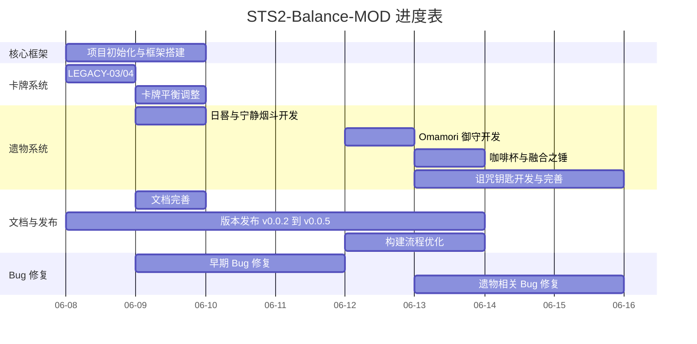

# STS2 平衡调整需求清单

> 本文档记录我对 Slay the Spire 2 的所有调整。

---

## 进度总览

**工作统计**

| 日期       | 主要工作                                            | 提交数 |
| ---------- | --------------------------------------------------- | ------ |
| 2026-06-08 | 项目初始化、框架搭建、LEGACY-03/04、发布流程        | 7      |
| 2026-06-09 | 遗物系统（日晷）、卡牌平衡、早期 Bug 修复、README   | 8      |
| 2026-06-12 | Omamori 御守、构建流程优化、版本更新 v0.0.4         | 8      |
| 2026-06-13 | 融合之锤、咖啡杯、诅咒钥匙基础版、遗物相关 Bug 修复 | 13     |
| 2026-06-14 | 诅咒钥匙完善、文档跟进                              | 8      |

---

## 1. 商店调整

- [x] SHOP-01 — V6 难度以上删牌价格调整为 25 金币（低进阶 50+25/次，高进阶 75+25/次）

## 2. 卡牌调整

- [x] CARD-01 — 骨妹升级的挽歌改为**不消耗**，不提高召唤次数
- [x] CARD-02 — 刀舞删除**消耗**词条，稀有度提高为**蓝卡**
- [x] CARD-03 — 杂技**蓝卡->白卡**（稀有度降级）
- [x] CARD-04 — 故障机器人认知偏差降低改为五回合之后消失，改为五回合每一回合扣一点，**之后不在继续扣除**
- [x] CARD-05 — 多重释放增加升级后保留词条
- [x] CARD-06 — 佩尔的许愿卡改为防 **18/20**
- [x] CARD-07 — 幽魂形态减敏捷负面清除
- [x] CARD-08 — 袖里乾坤定位和刀舞冲突，暂时删除      // TODO: 袖里乾坤后续改动效果
- [ ] CARD-09 — 腐蚀波改为单体效果，没有敲 1 点，敲了之后 2 点

## 3. 老版卡牌回归（新增卡牌）

> STS1 中存在但 STS2 中缺失或不同的卡牌，以新卡形式加入。

- [x] LEGACY-01 — 死亡收割（战士）
- [x] LEGACY-02 — 硬撑（战士）
- [x] LEGACY-03 — 全神贯注（猎人）
- [x] LEGACY-04 — 电动力学（机器人，**替换吞噬暗影**）

## 4. 怪物机制调整

- [x] MON-01 — Boss 沙漏：凋零卡改为**可打出并消耗**，保留成长机制
- [ ] MON-02 — Boss 新增 BOSS 时间吞噬者

## 5. 事件调整

- [ ] EVENT-01 — 双拳机器人事件**血量降低**
- [x] EVENT-02 — 旧日垃圾堆奖励加入**御守**

## 6. 遗物调整

- [x] RELIC-01 — 日晷：每将抽牌堆洗牌 3 次，获得 2 点能量。
- [x] RELIC-02 — 药丸：在回合内使用 能力/技能/攻击 牌之后，祛除所有负面效果（除女王的禁抽）
- [x] RELIC-03 — 树枝：每当你消耗一张牌增加一张随机手牌到你的手中
- [x] RELIC-04 — 坚固钳子：现改为保留 10 -> 20 护甲
- [x] RELIC-05 — 宁静烟斗：在火堆加一个删除卡牌的效果
- [x] RELIC-06 — 微笑面具：删牌价格固定 50
- [x] RELIC-07 — 达福的遗物里面补充：
  - [x] 咖啡杯: 在火堆无法休息，但是每回合多加一点费用
  - [x] 融合之锤: 你不再能够锻造，但是每回合多加一点费用
  - [x] 诅咒的钥匙: 每当打开一个宝箱获得一个随机诅咒，但是每回合多加一点费用

# 现有的问题以及无法解决的问题

## BUG 列表

- [x] BUG-01 — 联机报错黑屏: Parameter 'ModelId entry ID 1920 is out of range! We have 1627 entries'
- [x] BUG-02 — 死亡收割是单体的问题
- [x] BUG-03 — 虚无牌消耗之后 树枝生成的牌 不会保留在手里而是一起进入弃牌堆
- [x] BUG-04 — 注册逻辑放到了 Darv 的生成选项里面，没有注册到全局，Relic Collection 没法持续显示
- [x] BUG-05 — 如果是后买的面具，删牌价格不会及时更新

## FEATURE 列表

- [ ] FEATURE-01 — 游戏里没有宝箱跳过的选项，那么多人完全不知道如何做，所以**诅咒钥匙**现在基本就是拿了稳定三诅咒的
