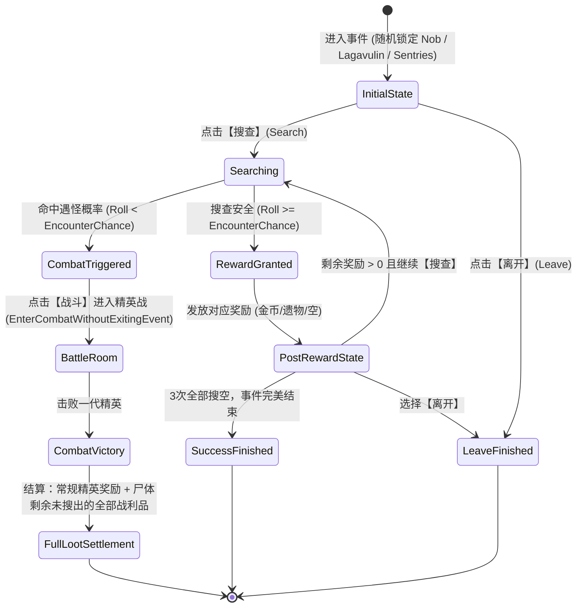

# 事件详细设计方案：冒险者尸体 (Dead Adventurer) 与 地精对对碰 (Match and Keep)

本文档事无巨细记录了 **冒险者尸体 (Dead Adventurer)** 与 **地精对对碰 (Match and Keep)** 两个经典一代回归事件在 **Sts2BalanceMod** 中的完整设计规格、数值公式、状态机流转、敌人遭遇机制、资源依赖与本地化文本，供 Review 评审。

---

## 一、冒险者尸体 (Dead Adventurer)

### 1. 事件概述与定位

- **事件名称**：冒险者尸体 [Dead Adventurer]
- **C# 类名**：`DeadAdventurer`
- **章节归属**：**第 1 幕专属事件（Non-Shared）**
  - 在 STS2 中注册至第一幕的两个分支章节：
    ```csharp
    [RegisterActEvent(typeof(Overgrowth))]
    [RegisterActEvent(typeof(Underdocks))]
    ```
- **出没条件（IsAllowed）**：
  - 当前章节索引为第一幕：`runState.CurrentActIndex == 0`
  - 楼层限定：`runState.TotalFloor >= 7`（严格还原 STS1 原版设定，防止前 6 层卡组尚未成型时遇精英暴毙）
- **基础属性**：
  - `IsShared = false`
  - 继承自 `BalanceEventTemplate`

---

### 2. 核心机制与进阶数值规格

#### (1) 战利品池与洗牌逻辑

- 事件初始时在后台生成一个包含 3 项战利品的列表：
  - **30 金币** (`RewardType.Gold`, 金额 30G)
  - **1 件随机遗物** (`RewardType.Relic`, 从前序抽取件未拥有的随机遗物)
  - **一无所获** (`RewardType.Nothing`)
- 使用战局确定性随机数生成器（`Rng`）将这 3 项奖励进行费雪耶兹（Fisher-Yates）完全乱序打乱。
- 玩家每次搜查成功时，依次揭晓并领取队列顶端的战利品，最多搜查 3 次。

#### (2) 遇怪概率与进阶递增公式（核心区别）

在 STS1 中，该事件概率受进阶 15（不利事件 / Unfavorable Events）影响，在 STS2 中对应枚举 **`AscensionLevel.DeadlyEvents`**：

| 进阶梯度 | 初始遇怪几率 (`EncounterChanceStart`) | 每次搜查递增 (`EncounterChanceRamp`) | 3次搜查实时几率序列 |
| :-- | :-: | :-: | :-: |
| **标准进阶 (A0 ~ A14)** | **25%** | **+25%** | 第1次 25% → 第2次 50% → 第3次 75% |
| **高进阶 (A15+ / DeadlyEvents)** | **35%** | **+25%** | 第1次 35% → 第2次 60% → 第3次 85% |

- **动态计算实现**：
  ```csharp
  int encounterChanceStart = AscensionHelper.GetValueIfAscension(
      AscensionLevel.DeadlyEvents, 35, 25);
  int encounterChanceRamp = 25;
  ```
- **动态变量绑定**：
  - 选项描述中动态注入 `{EncounterChance}%`，保证玩家选项框实时显示当前的风险几率。

---

### 3. 事件交互流转与状态机



#### (1) 初始状态 (INITIAL)

- **潜伏敌人预判定**：
  - 初始随机生成 `_enemyType`（0 = 哨兵 Sentries, 1 = 地精大块头 GremlinNob, 2 = 乐嘉维林 Lagavulin）。
  - 根据潜伏敌人类型，动态展示不同的风味文本：
    - 哨兵：“你发现一具死去的冒险者尸体，旁边散落着散发着微弱火花的机械残骸……”
    - 地精大块头：“……尸体上有巨大的钝器重击痕迹，周围回荡着沉闷的咆哮声……”
    - 乐嘉维林：“……尸体被厚厚的坚壳抓痕撕裂，旁边传来一阵阵阴冷的鼾声……”
- **初始选项**：
  - **【搜查】**：`[寻找战利品] {EncounterChance}% 的几率引出怪物。`
  - **【离开】**：直接离开洞穴，不承担风险。

#### (2) 搜查成功 (GOLD / RELIC / NOTHING / SUCCESS)

- 若随机掷骰 `Rng.NextInt(100) >= _encounterChance`：
  - 弹出对应战利品结算界面并即时发放（获得 30 金币 / 弹出获得遗物弹窗 / 显示未找到有价值的物品）；
  - 遇怪几率累加：`_encounterChance += 25`；
  - 若已经搜满 3 次，展示 `SUCCESS` 页面，提示尸体已被搜空，仅剩【离开】选项；
  - 若未搜满，展示剩余搜查机会，允许玩家在更高风险下再次选择【搜查】或稳妥【离开】。

#### (3) 惊醒怪物与内嵌战斗 (FIGHT)

- 若随机掷骰 `Rng.NextInt(100) < _encounterChance`：
  - 切换到战斗就绪页面：`SetEventState(PageDescription("FIGHT"), [Option(EnterCombat, "FIGHT")])`；
  - 玩家点击【战斗】后，调用 RitsuLib / 核心引擎内嵌战斗 API：
    ```csharp
    EnterCombatWithoutExitingEvent(canonicalEncounter, extraRewards, true);
    ```
  - 战斗遭遇根据预判定的敌人，加载对应的专属遭遇模型（`DeadAdventurerNobEncounter` / `DeadAdventurerLagavulinEncounter` / `DeadAdventurerSentriesEncounter`）。

#### (4) 战利品补全结算补丁 (DeadAdventurerRewardsPatch)

- **核心补丁逻辑**：
  - 战胜后，系统会默认生成常规战斗房间奖励；
  - 通过 Harmony 挂载 `RewardsSet.WithRewardsFromRoom(AbstractRoom)`：
    - 保留常规精英战斗卡牌奖励与金币；
    - 检查进入战斗时尸体上**剩余未被摸走的战利品**（若遗物还没搜出来，则在此处额外注入 1 件遗物奖励；若金币还没搜出来，则额外叠加 30G 金币奖励）；
    - 确保玩家只要冒死战胜精英，就能拿满冒险者尸体的全额宝藏。

---

### 4. 三大一代精英怪还原设计

#### (1) 地精大块头 (Gremlin Nob)

- **模型与资源**：直接复用已有成熟模型 `Sts2BalanceMod/monsters/gremlin_nob/` 与类 `Sts2BalanceModCode/Monsters/GremlinNob.cs`。
- **行动模式**：
  - 第 1 回合：【怒吼 (Bellow)】获得狂怒能力（`EnragePower`，标准进阶每次玩家使用技能牌其获得 2 点力量，高进阶获得 3 点力量）；
  - 后续回合：交替使用【重击 (Skull Bash)】（打 6/8 伤害并施加 2 层易伤）与【猛冲 (Rush)】（单体 14/16 巨额物理伤害）。

#### (2) 乐嘉维林 (Lagavulin)

- **模型与骨骼**：迁移 `Assets/ActsFromPast` 下的 Spine 骨骼、动画与材质至 `Sts2BalanceMod/monsters/lagavulin/`。
- **专属能力**：`AsleepLagavulinPower`（休眠能力）
  - 初始携带 8 层金属化（护甲防御）；
  - 处于沉睡状态，持续 3 回合；若在此期间受到玩家生命值伤害，立刻惊醒；
  - 3 回合后自动惊醒。
- **行动模式**：
  - 沉睡期间：不行动；
  - 惊醒后：循环释放【强力攻击】（18/20 物理伤害）与【灵魂吸取 (Siphon Soul)】（使所有玩家获得 -1 力量与 -1 敏捷，高进阶为 -2 力量与 -2 敏捷）。

#### (3) 三哨兵 (Sentries)

- **模型与骨骼**：迁移 `Assets/ActsFromPast` 下的 Spine 骨骼、动画与材质至 `Sts2BalanceMod/monsters/sentry/`。
- **槽位排布**：3 只哨兵排成一列（左、中、右）。
- **行动模式**：
  - 初始各携带 1 层人工制品（`ArtifactPower`）；
  - 左右两只初始交替开火，一只先打【激光 (Beam)】（9/10 伤害），另一只先放【雷击 (Bolt)】（向玩家弃牌堆塞入 2/3 张 `Dazed` 眩晕牌）；
  - 中间哨兵与两侧错开节奏，形成极具威胁的卡手循环。

---

## 二、地精对对碰 / 翻牌配对 (Match and Keep)

### 1. 事件概述与定位

- **事件名称**：对对碰 [Match and Keep]
- **C# 类名**：`MatchAndKeep`
- **章节归属**：**全幕共享神龛事件（Shared Shrine Event）**
  ```csharp
  [RegisterSharedEvent]
  public sealed class MatchAndKeep : BalanceEventTemplate, IShrineEvent
  ```
- **出没条件（IsAllowed）**：
  - 全幕均可出没，无额外卡组限制；
  - 标记为神龛事件，遵循神龛事件池规则。
- **背景原画**：
  - 采用用户提供的专属重绘背景图：`image_gen/source/events/MatchAndKeep.png`（规范化同步至 `Sts2BalanceMod/images/events/MatchAndKeep.png`）。

---

### 2. 核心小游戏机制规范

#### (1) 卡牌抽取与配对池生成算法

游戏盘面上共有 **12 张面朝下的暗牌**，对应 **6 对配对卡牌（每对 2 张完全相同的卡牌）**。
卡牌配对池严格按以下规则生成：

| 槽位编号 | 卡牌分类与来源 | 抽取规则与限制 |
| :-: | :-- | :-- |
| **第 1 对** | **金卡 (Rare)** | 从当前玩家职业未解锁卡池中随机抽取 1 张稀有卡 |
| **第 2 对** | **罕见卡 (Uncommon)** | 从当前玩家职业未解锁卡池中随机抽取 1 张罕见卡 |
| **第 3 对** | **普通卡 (Common)** | 从当前玩家职业未解锁卡池中随机抽取 1 张普通卡 |
| **第 4 对** | **诅咒卡 (Curse #1)** | 从诅咒卡池（`CurseCardPool`）中随机抽取（如寄生、悔恨等） |
| **第 5 对** | **诅咒卡 (Curse #2)** | 从诅咒卡池（`CurseCardPool`）中随机抽取第 2 张诅咒 |
| **第 6 对** | **基础卡 (Basic)** | 从职业初始牌中抽取非打击、非防御的基础功能牌（若无则退化为普通牌） |

- **生成 12 张卡牌实例**：将上述 6 种卡牌每种复制 2 份，建立 `PairIndex` 索引（0~5），并使用 Fisher-Yates 算法将 12 张牌完全随机打乱后放入 4×3 网格。

#### (2) 尝试次数与翻牌规则

- **最大尝试次数**：**5 次**（`Attempts = 5`）；
- 玩家每次翻开 2 张牌计为 1 次配对尝试：
  - **配对成功（Match）**：
    - 两张牌的卡牌 ID 相同；
    - 触发成功 Tween 动效，两张卡牌平移至屏幕中央合并；
    - 调用 `CardPileCmd.Add(card, PileType.Deck)` 将该卡牌**永久加入玩家牌组**，并触发卡牌入队浮现预览；
    - 该卡牌槽位标记为永久消除；
    - 消耗 1 次尝试机会。
  - **配对失败（Mismatch）**：
    - 两张牌放大展示 1.25 秒，让玩家记忆卡牌位置；
    - 延时结束后，两张牌翻回背面并缩回网格默认尺寸；
    - 消耗 1 次尝试机会。
- **游戏结束判定**：
  - 6 对卡牌全部成功配对，或 5 次机会全部耗尽；
  - 剩余未配对的暗牌执行滑出屏幕下方的清理动画并淡出。

---

### 3. Godot 全屏 UI 与控制器交互架构 (`NMatchAndKeepScreen`)

- **全屏覆盖层架构**：
  - 继承 `Control, IOverlayScreen, IScreenContext`，通过 `NOverlayStack.Instance.Push` 挂载；
  - 背景直接铺满展示用户提供的 `MatchAndKeep.png`（自适应保持纵横比）；
  - 底部展示 BBCode 格式化标签：`[center]剩余次数：{Count}[/center]`。
- **4×3 网格坐标与发牌动效**：
  - 列偏移（X）：`[-320, -110, 100, 310]`；
  - 行偏移（Y）：`[-210, 20, 250]`；
  - 发牌时卡牌从屏幕底部（`Y = +800`）呈三次贝塞尔平滑滑动至网格对应点。
- **暗牌卡背与原生卡面融合**：
  - 翻开前：覆盖 STS1 经典卡背图集（`cardui.atlas` / `cardui4.png`），并屏蔽鼠标悬停 HoverTip，避免玩家通过悬停作弊透视暗牌信息；
  - 翻开后：显示 STS2 原生 `NCard` 与 `NGridCardHolder`，原汁原味展现 STS2 高清卡面。
- **手柄十字键导航焦点映射 (`SetupFocusNeighbors`)**：
  - 针对 Steam Deck 与手柄操作，动态计算 4×3 网格的上下左右相邻焦点；
  - 当某张牌被成功消除后，自动重构邻居索引树，光标导航会自动绕过已消除的空位，绝不卡死。

---

## 三、资源清单与本地化映射表

### 1. 资源文件迁移与部署清单

| 资源类别 | 原始路径 | 目标部署路径 | 用途 |
| :-- | :-- | :-- | :-- |
| **地精对对碰背景** | `image_gen/source/events/MatchAndKeep.png` | `Sts2BalanceMod/images/events/MatchAndKeep.png` | 事件立绘与小游戏背景 |
| **冒险者尸体立绘** | `Assets/ActsFromPast/images/event_extras/dead_adventurer.png` | `image_gen/source/events/DeadAdventurer.png`<br>`Sts2BalanceMod/images/events/DeadAdventurer.png` | 事件标准立绘 |
| **乐嘉维林骨骼** | `Assets/ActsFromPast/ActsFromThePast/monsters/lagavulin/*` | `Sts2BalanceMod/monsters/lagavulin/*` | 乐嘉维林 Spine 动画与模型 |
| **哨兵骨骼** | `Assets/ActsFromPast/ActsFromThePast/monsters/sentry/*` | `Sts2BalanceMod/monsters/sentry/*` | 哨兵 Spine 动画与模型 |
| **乐嘉休眠能力图** | `Assets/ActsFromPast/images/powers/actsfromthepast-asleep_lagavulin_power.png` | `Sts2BalanceMod/images/powers/AsleepLagavulinPower.png` | 状态栏休眠图标 |
| **暗牌卡背图集** | `Assets/ActsFromPast/images/event_extras/cardui.atlas`, `cardui4.png` | `Sts2BalanceMod/images/event_extras/*` | 小游戏暗牌卡背覆层 |

---

### 2. 本地化词条表 (Localization Reference)

#### 冒险者尸体 (`ACTSFROMTHEPAST-DEAD_ADVENTURER` → `STS2_BALANCE_MOD-DEAD_ADVENTURER`)

- `title`: 冒险者尸体 (Dead Adventurer)
- `pages.INITIAL.description.SENTRIES`: 你发现一具[red]死去的冒险者[/red]倒在地上。旁边散落着散发微光的古代机械残骸，似乎还潜藏着什么……
- `pages.INITIAL.description.NOB`: 你发现一具[red]死去的冒险者[/red]倒在地上。他的装备被巨大的重型钝击砸得粉碎，周围回荡着令人不安的粗重喘息声……
- `pages.INITIAL.description.LAGAVULIN`: 你发现一具[red]死去的冒险者[/red]倒在地上。他身边散落着一些装备，四周异常寂静，只有一阵阴冷的沉睡鼾声……
- `pages.INITIAL.options.SEARCH.title`: 搜查 (Search)
- `pages.INITIAL.options.SEARCH.description`: [green]寻找战利品[/green]。有 [red]{EncounterChance}%[/red] 的几率惊动周围潜伏的敌人。
- `pages.INITIAL.options.LEAVE.title`: 离开 (Leave)
- `pages.INITIAL.options.LEAVE.description`: 不打扰尸体，直接离开。
- `pages.FIGHT.description`: 搜寻战利品的声音惊醒了潜伏的怪物！它咆哮着向你扑来！
- `pages.FIGHT.options.ENTER_COMBAT.title`: 迎战 (Fight)
- `pages.GOLD.description`: 你在尸体口袋里找到了 [gold]30 金币[/gold]！\n要继续搜查吗？
- `pages.RELIC.description`: 你从他的背囊中找到了一件 [gold]遗物[/gold]！\n要继续搜查吗？
- `pages.NOTHING.description`: 你仔细搜查了一阵，什么有价值的物品也没找到。\n要继续搜查吗？
- `pages.SUCCESS.description`: 你已经把尸体上下彻底搜刮一空，周围没有别的东西了。

#### 地精对对碰 (`ACTSFROMTHEPAST-MATCH_AND_KEEP` → `STS2_BALANCE_MOD-MATCH_AND_KEEP`)

- `title`: 对对碰 (Match and Keep)
- `pages.INITIAL.description`: 一位身材矮小、满脸狡黠的地精正在一张石桌前摆弄着一副纸牌。看到你靠近，他咧嘴一笑。\n“嘿！旅行者！想不想跟我玩个有趣的小游戏？”
- `pages.INITIAL.options.CONTINUE.title`: 继续 (Continue)
- `pages.RULES.description`: “规则很简单：[blue]十二张牌[/blue]，[blue]两两配对[/blue]。你有 [gold]5 次机会[/gold]，翻到相同的两张牌就能直接拿走！\n准备好了吗？开始翻牌吧！”
- `pages.RULES.options.PLAY.title`: 开始小游戏 (Play)
- `minigame.attempts`: 剩余尝试次数：{Count}
- `pages.COMPLETE.description`: 地精收起剩余的卡牌，拍了拍手。\n“游戏结束！希望你拿到了称心如意的好牌，嘿嘿嘿……”
- `pages.COMPLETE.options.LEAVE.title`: 离开 (Leave)

---

请 Review 审阅以上设计规范。一旦确认通过，我们将立即按此文档展开代码编写与功能交付！
