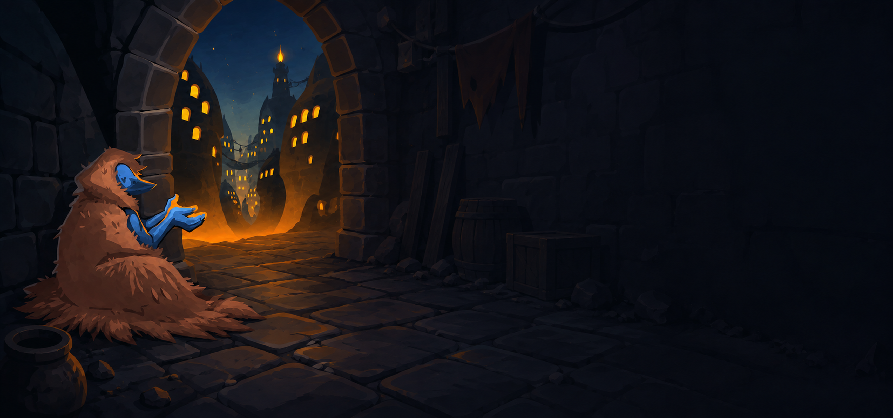
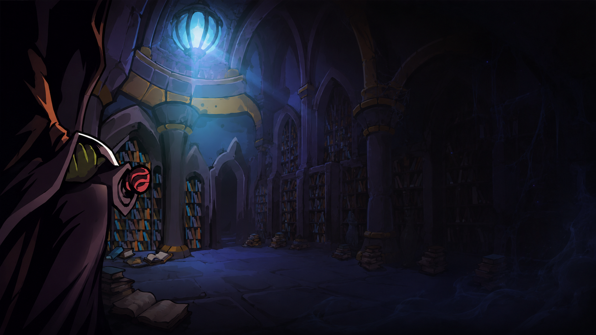

# Sts2BalanceMod — 事件与遭遇手册 (Events Guide)

本文档归纳整理了 **Sts2BalanceMod** 中所有调整的原版事件以及新增回归的 1 代经典事件。

---

## 目录

- [原版事件调整 (Modified Vanilla Events)](#原版事件调整-modified-vanilla-events)
- [一代回归事件 (STS1 Classic Events Return)](#一代回归事件-sts1-classic-events-return)

---

## 原版事件调整 (Modified Vanilla Events)

对游戏原版已有事件选项、价格与逻辑进行的平衡调整。

| 事件配图 | 事件名称 | C# 类名 / ID | 调整内容 |
| :---: | :--- | :--- | :--- |
|  | **禅意织者 [Zen Weaver]** | `ZenWeaverCostPatch` | **删牌价格大幅下调**： • 删 1 张牌价格从 125 金币**下调至 75 金币**（事件触发门槛同步降至 75 金）。 • 删 2 张牌价格从 250 金币**下调至 150 金币**。 |
|  | **旧日垃圾堆 [Trash Heap]** | `TrashHeapAddCustomRelicAndCard` | 遗物奖励池中加入  **御守 [Omamori]**。 |
|  | **除虫者 [Bugslayer]** | `EventLeaveOptionPatches` | 初始选项中**新增「离开」分支**，允许玩家直接走开而无须获取卡牌（可在 Mod 设置中开关）。 |
|  | **科学怪人 [Tinker Time]** | `EventLeaveOptionPatches` | 初始选项中**新增「离开」分支**，允许玩家直接走开而不用强制接受突变卡（可在 Mod 设置中开关）。 |
|  | **药水的未来？ [The Future of Potions]** | `EventLeaveOptionPatches` | 初始选项中**新增「离开」分支**，允许玩家保留药水直接离开（可在 Mod 设置中开关）。 |

---

## 一代回归事件 (STS1 Classic Events Return)

从《杀戮尖塔 1》完整移植并重新制作的经典事件，包含全新交互、特殊逻辑与联动机制。

| 事件配图 | 事件名称 | 先行条件 | 详细选项与效果 |
| :---: | :--- | :--- | :--- |
|  | **老乞丐 [Old Beggar]** `OldBeggar` | 所有玩家金币 ≥ 75 | • **【给金币】**：失去 75 金币，乞丐脱下外套变身为[牧师]，从牌组中移除 1 张牌。 • **【离开】**：不给钱直接离开。 |
|  | **诅咒书本 [Cursed Tome]** `CursedTome` | Act 2，且牌组无对应书籍遗物 | 连续翻页扣血（1+2+3 HP 或 2+3+3 HP）： • **【拿走】**：随机获得  **死灵之书**、 **尼利的宝典** 或  **英雄宝典**。 • **【停止 / 离开】**：合上书本离开。 |
|  | **面具强盗 [Masked Bandits]** `MaskedBandits` | Act 2，层数 ≥ 23，且无人持有红面具 | • **【交钱】**：失去所有金币。 • **【开战】**：与红面具三人帮（Pointy, Romeo, Bear）战斗，获胜获得  **红面具**。 *（强盗战斗归入事件战斗图鉴；Bear 首回合【熊抱】改为施加 -2 敏捷）* |
|  | **增益研究者 [Augmenter]** `Augmenter` | Act 2，且所有玩家牌组中可移除牌 ≥ 2 张 | • **【试一下 J.A.X.】**：将 J.A.X. 卡牌加入牌组。 • **【当实验对象】**：变化 2 张牌。 • **【喝突变剂】**：获得  **突变之力** 遗物。 |
|  | **神圣泉水 [The Divine Fountain]** `TheDivineFountain` | 所有玩家牌组中存在可移除的诅咒牌 | • **【喝水】**：移除牌组中的**所有诅咒牌**（已删除了原版的伤害副作用）。 • **【离开】**：直接走开。 |
|  | **牧师 [Cleric]** `Cleric` | 所有玩家金币 ≥ 35 | • **【治疗】**：失去 35 金币，回复 25% 最大生命值。 • **【净化】**：失去 75 金币，移除 1 张牌。 • **【离开】**：不接受服务走开。 |
|  | **心灵绽放 [Mind Bloom]** `MindBloom` | Act 3 | • **【我即战争】**：与第一幕 Boss 战斗，胜获得 50 金 + 稀有遗物；战胜后可选择 **【继续深入】** 接受随机二战遭遇（守护者/六火亡魂/史莱姆老大 + 随机强化），胜额外得 100 金 + 稀有遗物 + 罕见遗物。 • **【我即清醒】**：升级牌组中所有牌，并获得  **绽放印记**。 • **【我即富足】**：（层数 < 41，多人 < 38）获得 999 金币，牌组加入 2 张「凡庸」。 |
|  | **大转盘 [Wheel of Change]** `WheelOfChange` | 无 | 旋转随机转盘： • 金币 (+100~300) • 随机遗物 • 恢复全部生命 • 获得诅咒「腐朽」 • 移除 1 张牌 • 受到伤害 |
|  | **红面具大人之墓 [Tomb of Lord Red Mask]** `TombOfLordRedMask` | Act 3，且无人持有红面具 | • **【献上敬意】**：献上所有金币，获得  **红面具**。 • **【戴上红面具】**：（已持有红面具）收获 222 金币。 • **【离开】**：不打扰墓穴。 |
|  | **大图书馆 [The Library]** `TheLibrary` | Act 3 | • **【阅读】**：从 20 张跨职业卡牌中选择 1 张加入牌组。 • **【睡觉】**：回复 33% 最大生命值。 |
